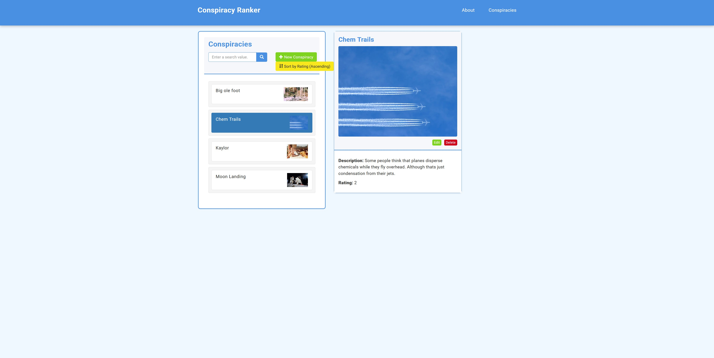
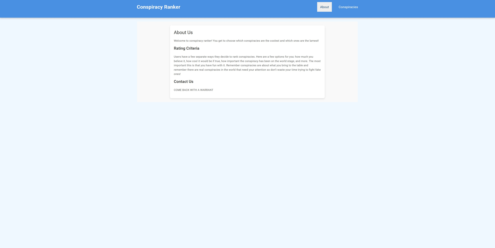

# Overview

Conspiracy Ranker is built on Angular, a Express/Node server and a MongoDB database. I used Bootstrap version 3 for the styling. This was one of the first few times I had used Bootstrap, and I liked it well enough. I used a service to communicate accross components. The data comes from a local MongoDB database which connects to an Express server letting the frontend use REST endpoints to access the needed information.

[Brief Demo](https://youtu.be/hyyGc6Y_x_w)

# Development Environment

I developed this in VS Code and used the browser to view my application during development.

 
